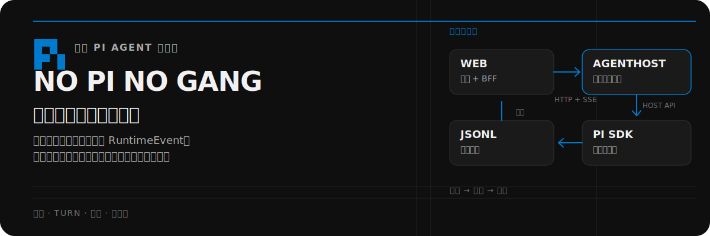
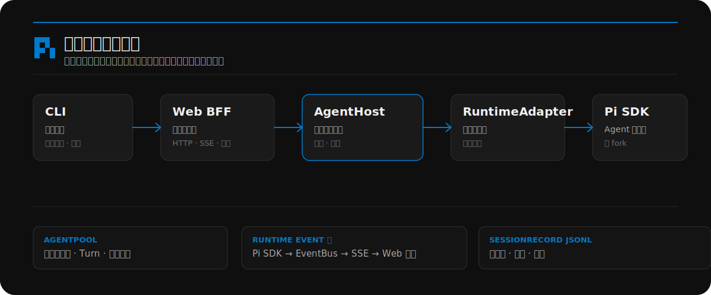
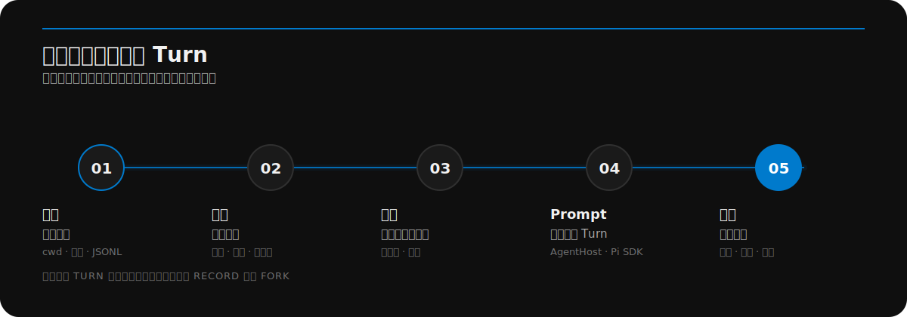

<p align="center">
  
</p>

<p align="center">
  <a href="https://github.com/minuque/no-pi-no-gang/actions/workflows/verify.yml"></a>
  <a href="https://github.com/minuque/no-pi-no-gang/blob/main/LICENSE"></a>
  <a href="https://github.com/badlogic/pi-mono"></a>
</p>

<p align="center"><strong>中文</strong> · <a href="README_EN.md">English</a></p>

> Pi Agent 的本地控制面：观察运行、理解历史，并从正确的上下文继续工作。

no-pi-no-gang 不是通用聊天应用，而是面向 [Pi](https://github.com/badlogic/pi-mono) 的浏览器工作台：把 Agent 运行时、实时执行状态、文件、分支和持久化会话历史集中在一个界面中。

## 你能看见和控制什么

- **Session 与分支** — 按工作目录聚合本地会话，查看消息历史，导航 `SessionRecord` 分支，重命名或删除会话，并从指定记录或文件上下文 Fork。
- **实时 Turn** — 通过 SSE 展示回复、思考、工具调用、压缩、连接状态和运行时错误；执行权始终归 AgentHost 所有。
- **工作区上下文** — 浏览当前工作目录、预览文件，并在不离开会话的情况下把文件内容加入 Prompt。
- **运行时配置** — 管理供应商、模型、API Key、OAuth 登录、思考级别映射和本地技能配置。
- **技能管理** — 搜索、安装并查看 Agent 可用的本地技能。
- **恢复与布局** — 刷新后检测活动会话、重连 `RuntimeEvent` 流，并围绕当前任务调整深色三栏工作台。

## 它如何工作

仓库只有一条生产链路：CLI 监督 Web 与 AgentHost；Web 负责浏览器交互和 BFF 路由；AgentHost 独占运行时创建、命令、会话修改、并发和事件交付；`runtime-pi` 负责适配 Pi SDK。

<p align="center">
  
</p>

Pi 的 `.jsonl` 会话历史仍是持久化事实源，不引入并行业务数据库，也不建立第二套进程内运行时实现。

## 一次会话的完整路径

<p align="center">
  
</p>

核心术语保持简洁且统一：

| 术语 | 含义 |
| --- | --- |
| `Session` | 由 Session ID 标识的持久化对话聚合。 |
| `Turn` | Session 内从一次 Prompt 到完成的一轮执行。 |
| `SessionRecord` | 用于重建消息、上下文和分支树的不可变持久化记录。 |
| `RuntimeEvent` | 执行期间产生、经 AgentHost 事件流交付的运行时无关事件。 |

## 快速开始

### 源码开发

```bash
npm install
npm run build
```

在两个终端分别启动 AgentHost 和 Web：

```bash
npm run agent-host
npm run dev
```

打开 [http://localhost:7777](http://localhost:7777)。AgentHost 默认监听 `http://127.0.0.1:7789`。

### 构建后的 CLI

执行 `npm run build` 后，生产入口会监督两个进程，并在就绪后自动打开浏览器：

```bash
node bin/no-pi-no-gang.js
```

使用 `-p <port>` 修改 Web 端口；设置 `NO_OPEN=1` 可禁止自动打开浏览器。

## 命令

| 命令 | 用途 |
| --- | --- |
| `npm run dev` | 在 `7777` 端口启动 Web 开发服务。 |
| `npm run agent-host` | 在 `7789` 端口启动已构建的 AgentHost。 |
| `npm run build` | 构建协议、运行时适配器、AgentHost、CLI 和 Web workspace。 |
| `npm run typecheck` | 检查所有 workspace 的 TypeScript 类型。 |
| `npm run lint` | 运行整个 Monorepo 的 ESLint。 |
| `npm run test` | 运行 Web 与 CLI 的 Vitest 测试。 |
| `npm run verify:fast` | 运行类型检查、Lint 和单元测试。 |
| `npm run verify` | 运行格式、设计检查、快速检查和生产构建。 |
| `npm run verify:release` | 运行完整检查、生产 E2E、包 smoke test 和发布闸门。 |

## API 与数据边界

AgentHost 将活动运行时操作与持久化 Session 操作分开：

| 边界 | 职责 |
| --- | --- |
| `/v1/runtimes*` | 创建或恢复运行时、执行命令、管理 Turn，并发布 `RuntimeEvent` 流。 |
| `/v1/sessions*` | 读取或修改持久化 Session、Record、分支和 Fork。 |
| `/api/agent/*` | 面向浏览器的运行时命令与事件稳定路由。 |
| `/api/sessions/*` | 面向浏览器的 Session 读取与修改稳定路由。 |
| `/api/files/[...path]` | Web 专属的工作区文件预览。 |

Web BFF 只负责校验和代理请求，不创建 `RuntimeAdapter`，也不直接操作 Pi Session 文件。

Pi 数据位于：

```text
~/.pi/agent/
  sessions/<cwd>/<timestamp>_<uuid>.jsonl
  models.json
  settings.json
```

## 仓库结构

```text
apps/
  cli/              生产入口与双进程监督器
  agent-host/       运行时所有权、AgentPool、HTTP API、事件、工具、工作区
  web/              Next.js UI 与面向浏览器的 BFF
packages/
  agent-protocol/   运行时无关契约与统一术语
  runtime-pi/       Pi RuntimeAdapter 与 SessionRecord 持久化映射
docs/adr/           已接受的架构决策
scripts/            构建、发布与 npm 包 smoke test
tests/              跨 workspace Vitest 测试
```

## 设计约束

视觉和组件改动遵循 [DESIGN.md](DESIGN.md)：工作台以深色为主，采用克制的表面层级，保留 `#007acc` 作为主 accent，并优先复用现有 CSS token。

仓库的边界和统一术语见 [CONTEXT.md](CONTEXT.md)、[ROADMAP.md](ROADMAP.md) 与 [docs/adr/](docs/adr/)。

## 相关文档

- [AGENTS.md](AGENTS.md) — 协作、验收和仓库工作流规则
- [DESIGN.md](DESIGN.md) — 设计系统与视觉 token
- [CONTEXT.md](CONTEXT.md) — 领域语言与所有权边界
- [Pi_SDK.md](Pi_SDK.md) — Pi SDK 接口参考
- [ROADMAP.md](ROADMAP.md) — 产品与架构方向
- [docs/adr/](docs/adr/) — 已接受的架构决策

## 致谢

1. 灵感来自于 [agegr/pi-web](https://github.com/agegr/pi-web)，感谢原作者奠定基础。
2. 核心 Agent 运行时基于 [earendil-works/pi](https://github.com/earendil-works/pi)，感谢提供强大的 Runtime 支持。

## License

[MIT](LICENSE)
