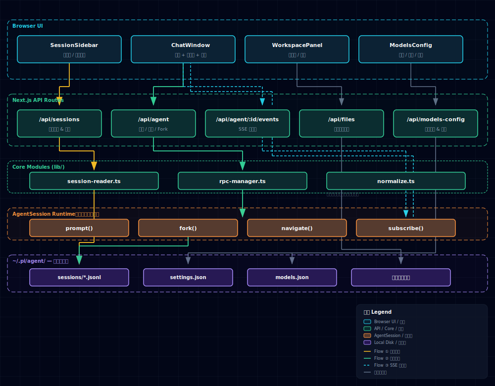

# no-pi-no-gang

<p align="center">
  
</p>

<p align="center">
  <strong><a href="https://github.com/badlogic/pi-mono">pi.dev</a></strong>
</p>

<p align="center">
  
  
  
  
  
</p>

## 概述

no-pi-no-gang 是 [pi.dev](https://github.com/badlogic/pi-mono) 的 Web UI——浏览器中的完整会话体验，附带图形化会话浏览、文件工作台和模型配置。沿用 pi 的 `.jsonl` + `AgentSession` 事实源模型，不引入额外持久层。

## 功能

| 能力 | 说明 |
|---|---|
| 会话浏览 | 按工作目录聚合本地 pi 会话，读取历史消息和分支树 |
| 实时对话 | SSE 流式响应、工具调用、思考/压缩态可视化 |
| Fork / Branch | 文件级 Fork + 同文件内消息分支切换 |
| 模型配置 | 界面内切换模型、配置工具集、管理供应商 |
| 技能管理 | 搜索、安装、查看技能配置 |
| 文件工作台 | 侧边栏浏览工作目录，辅助上下文追溯 |
| 运行态恢复 | 刷新后自动检测并重连 SSE |

## 安装

```bash
# 配置 GitHub Packages registry（仅需一次）
npm config set @minuque:registry https://npm.pkg.github.com/

# Unix: 从 bash 读取 GH_TOKEN
npm login --registry=https://npm.pkg.github.com
# Username: 你的 GitHub 用户名
# Password: GitHub personal access token（需 write:packages 权限）

# 安装为项目依赖
npm install @minuque/no-pi-no-gang

# 或直接运行
npx @minuque/no-pi-no-gang
```

## 本地开发

```bash
bun install
bun run dev                     # → http://localhost:7777

bun run build
bun run start                   # → http://localhost:7777
```

## 架构

no-pi-no-gang 是基于 pi 的 Web UI：浏览器负责交互，Next.js API 层转发命令，`AgentSession` 运行智能体逻辑，`~/.pi/agent/` 落盘历史。



### 数据目录

复用 pi 的本地数据，无需额外配置：

```text
~/.pi/agent/
  sessions/<cwd>/<timestamp>_<uuid>.jsonl   # 会话历史
  models.json                                # 模型配置
  settings.json                              # 用户偏好
```

### 三条主链路

| 链路 | 入口 | 核心 | 输出 |
|---|---|---|---|
| 历史读取 | `GET /api/sessions` | `session-reader.ts` 扫描解析 `.jsonl` | 会话树、消息列表、分支上下文 |
| 命令发送 | `POST /api/agent/*` | `rpc-manager.ts` 管理 `AgentSession` 生命周期 | prompt / fork / navigate 等动作 |
| 事件流 | `GET /api/agent/[id]/events` | `session.subscribe()` + SSE | 流式消息、工具调用、状态变更 |

### 模块边界

| 层级 | 负责 | 不负责 |
|---|---|---|
| 浏览器 UI | 展示会话、发送命令、消费 SSE | 直接读写 `.jsonl` 或执行智能体逻辑 |
| Next.js API | 校验请求、读取本地文件、管理 SSE | 保存额外业务数据库 |
| `session-reader.ts` | 只读解析历史会话 | 创建 `AgentSession` |
| `rpc-manager.ts` | `AgentSession` 生命周期和命令分发 | 解析会话列表 |
| `AgentSession` | 执行 pi 动作、写入会话事实 | 管理 Web UI 状态 |

## 项目结构

```text
app/api/
  agent/          # 新建会话、消息、Fork/Branch、压缩、SSE
  sessions/       # 会话列表、详情、上下文
  files/          # 工作目录文件读取
  models/         # 可用模型列表
  models-config/  # models.json 读写与测试
  auth/           # provider、OAuth、API Key 登录
  skills/         # 技能搜索、安装和列表
components/       # 三栏 UI、聊天流、会话树、文件工作台
hooks/            # 前端状态机与会话事件处理
lib/
  session-reader.ts  # .jsonl 读取、解析、规范化
  rpc-manager.ts     # AgentSession 包装、生命周期、命令分发
  normalize.ts       # 消息字段兼容和 toolCall 规范化
docs/             # 补充文档
bin/              # npm CLI 启动入口
```

## 脚本

| 命令 | 说明 |
|---|---|
| `bun run dev` | 开发服务 `localhost:7777` |
| `bun run build` | 生产构建 |
| `bun run start` | 启动构建产物 |
| `bun run lint` | ESLint 全仓检查 |
| `node_modules/.bin/tsc --noEmit` | 类型检查 |

提交前验收：

```bash
bun run build && bun run start
```

## 相关文档

- [ROADMAP.md](ROADMAP.md) — 系统架构、数据流、迭代路线
- [TODO.md](TODO.md) — 按优先级组织的任务包
- [Pi_SDK.md](Pi_SDK.md) — pi SDK 接口说明
- [AGENTS.md](AGENTS.md) — 协作、验证和文档约束

## 致谢

本项目 fork 自 [agegr/pi-web](https://github.com/agegr/pi-web)，感谢原作者的杰出贡献。

## License

[MIT](LICENSE)
