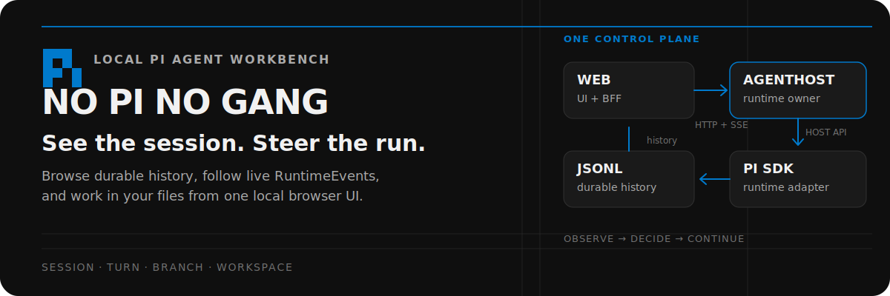
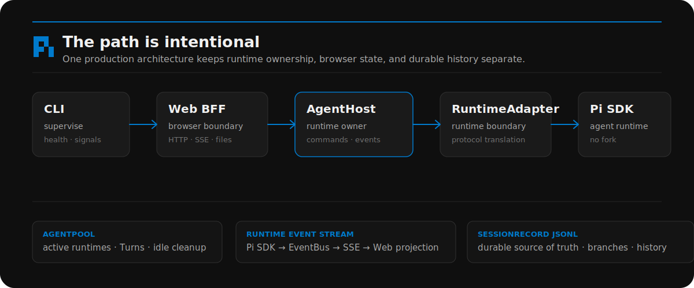
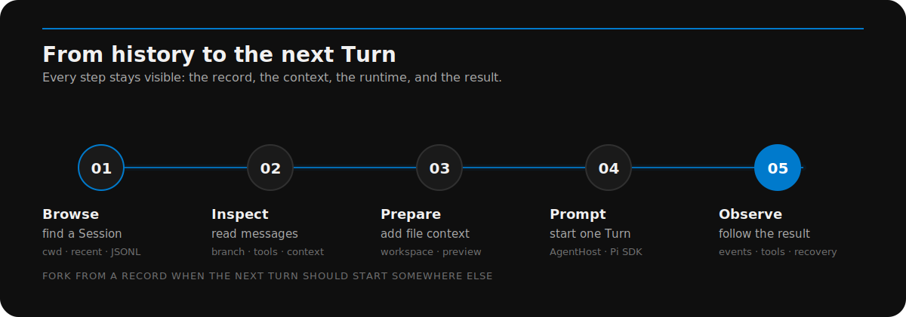

<p align="center">
  
</p>

<p align="center">
  <a href="https://github.com/minuque/no-pi-no-gang/actions/workflows/verify.yml"></a>
  <a href="https://github.com/minuque/no-pi-no-gang/blob/main/LICENSE"></a>
  <a href="https://github.com/badlogic/pi-mono"></a>
</p>

<p align="center"><a href="README.md">中文</a> · <strong>English</strong></p>

> A local control plane for Pi agents — built for observing work, understanding history, and continuing from the right context.

no-pi-no-gang is not another general-purpose chat app. It is a browser workbench for [Pi](https://github.com/badlogic/pi-mono) that keeps the agent runtime, live execution state, files, branches, and durable session history visible in one place.

## What you can see and control

- **Sessions and branches** — group local sessions by working directory, inspect message history, navigate `SessionRecord` branches, rename or delete sessions, and fork from a chosen record or file context.
- **Live Turns** — stream replies, thinking, tool calls, compaction, connection state, and runtime errors over SSE while the `AgentHost` owns execution.
- **Workspace context** — browse the active working directory, preview files, and add file content to a prompt without leaving the session.
- **Runtime configuration** — manage providers, models, API keys, OAuth login, thinking-level maps, and local skill configuration.
- **Skills** — search, install, and inspect the local skills available to the agent.
- **Recovery and layout** — detect active sessions after refresh, reconnect the `RuntimeEvent` stream, and resize the dark three-column workbench around the task at hand.

## How it works

The repository has one production path. The CLI supervises the Web app and AgentHost; the Web app owns browser interaction and BFF routes; AgentHost owns runtime creation, commands, session mutation, concurrency, and event delivery; `runtime-pi` adapts the Pi SDK.

<p align="center">
  
</p>

The durable source of truth remains Pi's `.jsonl` session history. There is no parallel business database and no second in-process runtime implementation.

## A session at a glance

<p align="center">
  
</p>

The core vocabulary is deliberately small:

| Term              | Meaning                                                                                      |
| ----------------- | -------------------------------------------------------------------------------------------- |
| `Session`       | A durable conversation aggregate identified by a session ID.                                 |
| `Turn`          | One prompt-to-completion execution inside a Session.                                         |
| `SessionRecord` | An immutable persisted record used to rebuild messages, context, and the branch tree.        |
| `RuntimeEvent`  | A runtime-neutral event emitted during execution and delivered through the AgentHost stream. |

## Quick start

### Source development

```bash
npm install
npm run build
```

Start the two development processes in separate terminals:

```bash
npm run agent-host
npm run dev
```

Open [http://localhost:7777](http://localhost:7777). AgentHost listens on `http://127.0.0.1:7789` by default.

### Built CLI

After `npm run build`, the production entry point supervises both processes and opens the browser when ready:

```bash
node bin/no-pi-no-gang.js
```

Use `-p <port>` to change the Web port. Set `NO_OPEN=1` when the browser should not open automatically.

## Commands

| Command                    | Purpose                                                                          |
| -------------------------- | -------------------------------------------------------------------------------- |
| `npm run dev`            | Start the Web development server on port `7777`.                                |
| `npm run agent-host`     | Start the built AgentHost process on port `7789`.                               |
| `npm run build`          | Build the protocol, runtime adapter, AgentHost, CLI, and Web workspaces.         |
| `npm run typecheck`      | Type-check all workspaces.                                                       |
| `npm run lint`           | Run ESLint across the monorepo.                                                  |
| `npm run test`           | Run the Web and CLI Vitest suites.                                               |
| `npm run verify:fast`    | Run type checking, linting, and unit tests.                                      |
| `npm run verify`         | Run formatting, design checks, fast checks, and the production build.            |
| `npm run verify:release` | Run the full checks, production E2E suite, package smoke test, and release gate. |

## API and data boundaries

AgentHost separates active runtime operations from durable session operations:

| Boundary                 | Responsibility                                                                                  |
| ------------------------ | ----------------------------------------------------------------------------------------------- |
| `/v1/runtimes*`        | Create or resume runtimes, execute commands, manage Turns, and publish `RuntimeEvent` streams. |
| `/v1/sessions*`        | Read or mutate persisted sessions, records, branches, and forks.                                |
| `/api/agent/*`         | Stable browser-facing routes for runtime commands and events.                                   |
| `/api/sessions/*`      | Stable browser-facing routes for session reads and mutations.                                   |
| `/api/files/[...path]` | Web-only workspace file previews.                                                               |

Web BFF routes validate and proxy requests; they do not create `RuntimeAdapter`s or operate Pi session files directly.

Pi data lives under:

```text
~/.pi/agent/
  sessions/<cwd>/<timestamp>_<uuid>.jsonl
  models.json
  settings.json
```

## Repository map

```text
apps/
  cli/              Production entry point and dual-process supervisor
  agent-host/       Runtime ownership, AgentPool, HTTP API, events, tools, workspaces
  web/              Next.js UI and browser-facing BFF
packages/
  agent-protocol/   Runtime-neutral contracts and shared terminology
  runtime-pi/       Pi RuntimeAdapter and SessionRecord persistence mapping
docs/adr/           Accepted architecture decisions
scripts/            Build, release, and package smoke helpers
tests/              Cross-workspace Vitest tests
```

## Design constraints

Visual and component changes follow [DESIGN.md](DESIGN.md): the workbench is dark-first, uses a restrained surface hierarchy, keeps `#007acc` as its primary accent, and prefers existing CSS tokens over one-off styles.

The repository's accepted boundaries and terminology live in [CONTEXT.md](CONTEXT.md), [ROADMAP.md](ROADMAP.md), and [docs/adr/](docs/adr/).

## Related docs

- [AGENTS.md](AGENTS.md) — collaboration, verification, and repository workflow rules
- [DESIGN.md](DESIGN.md) — design system and visual tokens
- [CONTEXT.md](CONTEXT.md) — domain language and ownership boundaries
- [Pi_SDK.md](Pi_SDK.md) — Pi SDK interface reference
- [ROADMAP.md](ROADMAP.md) — product and architecture direction
- [docs/adr/](docs/adr/) — accepted architecture decisions

## Acknowledgments

This project is forked from [agegr/pi-web](https://github.com/agegr/pi-web). Thanks to the original author for the foundation.

## License

[MIT](LICENSE)
