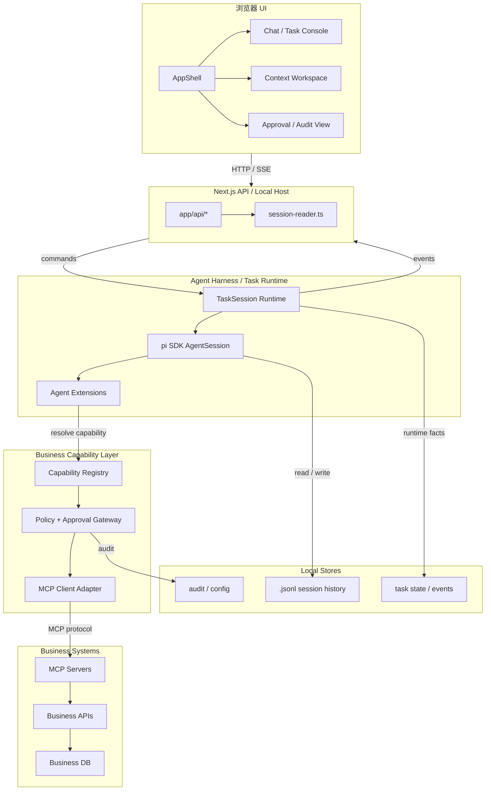
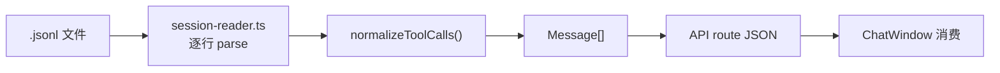
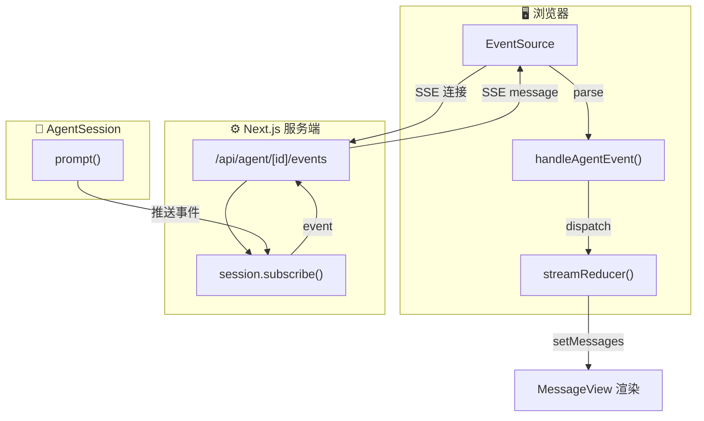
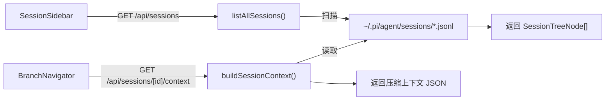
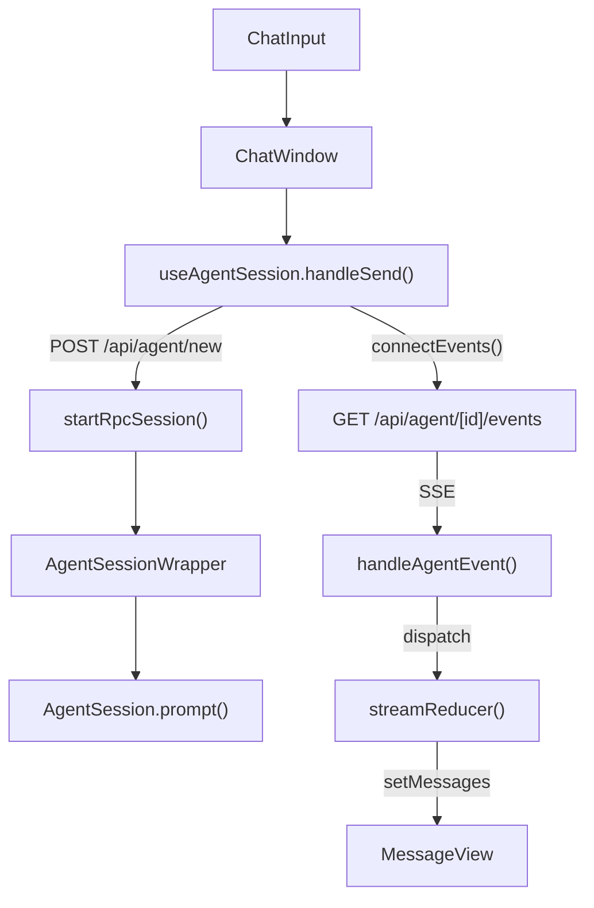
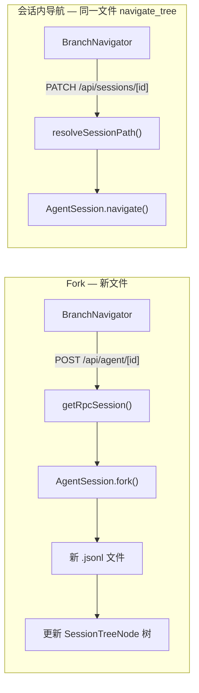
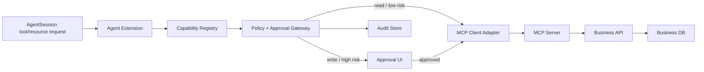
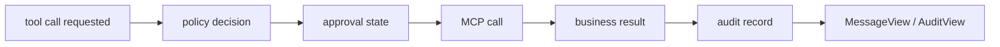
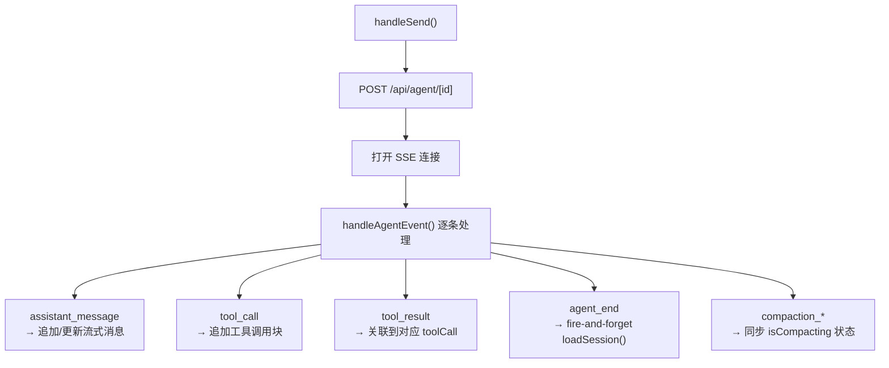
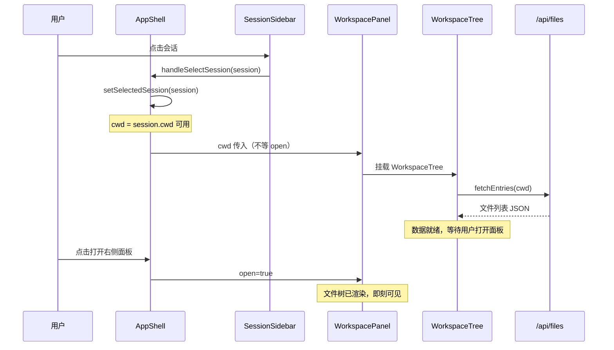

# ROADMAP

> [!abstract] 阅读路线
> 由远到近理解 no-pi-no-gang：**目标定位 → Runtime → MCP 业务能力层 → 事实源 → API/通信 → UI**。
> 首选深读 §1（项目定位）、§2（目标架构）和 §5（Capability Gateway），其余章节按需查阅。

---

## 1. 项目定位

no-pi-no-gang 的目标不是停留在 [pi 编程智能体](https://github.com/badlogic/pi-mono) 的 Web 外壳，而是演进为基于 `@earendil-works/pi-coding-agent` / pi SDK 的 **Agent Harness + Task Runtime**。

pi SDK 继续负责底层 `AgentSession`、模型调用、会话写入和 agent loop；no-pi-no-gang 负责在其上建立可观测、可治理、可插拔的运行时：

- 在浏览器中 ==展示和解释== 本地 `.jsonl` 会话文件
- 通过 ==TaskSession Runtime== 驱动、恢复、取消和订阅 AgentSession
- 利用 pi SDK ==扩展能力== 干预 agent loop，而不是二次修改 pi 源码
- 通过 ==Capability Gateway== 把 MCP 业务模块注册为可治理的 resources / prompts / tools
- 提供 ==会话、任务、分支、审批、审计== UI

> [!note] 核心约束
> no-pi-no-gang 可以实现 harness / runtime / policy / capability 编排逻辑，但不 fork pi 的核心 agent loop。业务状态也不落到 `.jsonl`：`.jsonl` 是会话事实源，业务数据库才是业务事实源。

---

## 2. 目标架构总览

### 2.1 目标架构



完整 HTML 架构图见 [docs/agent-mcp-business-architecture.html](docs/agent-mcp-business-architecture.html)。

### 2.2 五条数据流

| 流 | 协议 | 方向 | 核心模块 | 触发者 |
|---|---|---|---|---|
| ① 浏览流 | HTTP GET | 服务端→浏览器 | `session-reader.ts` | `SessionSidebar`, `BranchNavigator` |
| ② 任务命令流 | HTTP POST | 浏览器→Next→Task Runtime | `task-runtime` / `rpc-manager.ts` | `ChatInput`, Task Console |
| ③ 事件流 | SSE | Task Runtime→Next→浏览器 | `task-event-store` + `useAgentSession` | `ChatWindow` |
| ④ 能力解析流 | SDK extension | Agent loop→Capability Gateway | `capability-registry` | Agent tool/resource request |
| ⑤ 业务执行流 | MCP | Gateway→MCP Server→业务 API | `mcp-client-adapter` | 受治理的 tool call |

### 2.3 文件地图

```
no-pi-no-gang/
├── bin/no-pi-no-gang.js         CLI 入口，spawn Next.js
├── app/
│   ├── layout.tsx             RootLayout
│   ├── page.tsx               Home → AppShell
│   ├── globals.css            全局样式 + CSS 变量
│   └── api/                   路由处理器
│       ├── sessions/          会话 CRUD
│       ├── agent/             RPC 代理 + SSE
│       ├── files/             文件系统读取
│       ├── models/            模型配置
│       └── skills/            技能列表
├── components/                UI 组件
│   ├── AppShell.tsx           布局骨架
│   ├── ChatWindow.tsx         聊天主区（最复杂）
│   ├── ChatInput.tsx          输入框 + 文件拖拽
│   ├── MessageView.tsx        消息渲染入口
│   ├── SessionSidebar.tsx     左侧会话列表
│   ├── WorkspacePanel.tsx     右侧工作区面板
│   ├── WorkspaceTree.tsx      文件树组件
│   └── ...
├── hooks/
│   ├── useAgentSession.ts     核心状态机（最复杂 hook）
│   ├── useChatScroll.ts       虚拟滚动
│   └── useTheme.ts            主题切换
└── lib/
    ├── session-reader.ts      文件解析器（只读路径核心）
    ├── rpc-manager.ts         当前过渡期 AgentSession 生命周期
    ├── task-runtime/          目标：TaskSession Runtime
    ├── capability/            目标：Capability Registry / Gateway
    ├── mcp/                   目标：MCP Client Adapter
    ├── types.ts               UI 类型定义
    ├── pi-types.ts            pi 原生类型
    ├── normalize.ts           字段适配
    └── ...
```

---

## 3. 持久层与事实源模型

### 3.1 三类事实源

| 事实源 | 存放位置 | 负责内容 | 不负责 |
|---|---|---|---|
| 会话事实源 | `~/.pi/agent/sessions/*.jsonl` | 用户输入、模型输出、工具调用结果、分支历史 | 业务实体状态 |
| 运行事实源 | `TaskSession Runtime` + task event store | task 状态、事件序号、取消、重试、重连、最后错误 | 长期业务数据 |
| 业务事实源 | 公司业务数据库 / 业务 API | 项目、工单、客户、订单、审批结果 | agent 聊天历史 |

> [!important] 设计原则
> `.jsonl` 可以记录"agent 曾经请求更新工单、工具返回成功"，但不能成为"工单当前状态"的事实源。业务写入必须通过受治理的 MCP tool 调用业务 API，由业务系统自己落库。

### 3.2 会话存储格式

pi 把每个会话存为一个 `.jsonl` 文件，一行一条 entry：

```
~/.pi/agent/sessions/<编码后的工作目录>/<时间戳>_<uuid>.jsonl
```

每条 entry 的结构由 `lib/pi-types.ts` 定义（pi 原生格式）。

### 3.3 类型层次

```
lib/pi-types.ts        pi 原生类型（.jsonl entry 结构）
     │
     ▼
lib/types.ts           前端 UI 类型（Message、ToolCallContent 等）
     │
     ▼
lib/normalize.ts       字段名适配层
```

> [!important] 关键适配
> pi 存的是 `{type:"toolCall", id, name, arguments}`，UI 组件用的是 `{toolCallId, toolName, input}`。`normalizeToolCalls()` 在数据入口统一转换。

### 3.4 会话读取器



> [!tip] 只读路径
> `session-reader.ts` 不创建 AgentSession，不产生副作用。只有「发送消息」才会触发 AgentSession 创建。

---

## 4. API 与 Runtime 通信层

### 4.1 当前过渡层：rpc-manager.ts

```
lib/rpc-manager.ts
  └─ globalThis.__piSessions: Map<sessionId, AgentSessionWrapper>
  └─ globalThis.__piStartLocks: Map<sessionId, Promise>   // 防并发重复创建
```

> [!warning] globalThis 必须
> 不能用模块级 Map 存 AgentSession——Next.js 热重载会重置模块变量但 `globalThis` 存活。
> 每个会话 ID 一个 `AgentSessionWrapper`，空闲 10 分钟自动销毁。
> 并发 `startRpcSession()` 共享同一个启动 Promise，避免重复创建。

### 4.2 目标层：TaskSession Runtime

`rpc-manager.ts` 是当前版本的过渡实现。后续要把运行态从 Next.js UI 进程中剥离，形成独立的 TaskSession Runtime：

| 能力 | 说明 |
|---|---|
| `create(task)` | 创建新任务，绑定 `cwd`、模型、工具集、pi session |
| `resume(taskId)` | 从 task 状态和 `.jsonl` 恢复可继续运行的上下文 |
| `cancel(taskId)` | 取消当前生成或工具调用，保留历史和审计 |
| `subscribe(taskId, seq)` | 从指定事件序号补齐历史事件，再接 live SSE |
| `status(taskId)` | 返回 running / idle / failed / compacting / waiting_approval |

> [!tip] Runtime 边界
> ChatWindow 可以卸载，Next.js 可以热重载，但 TaskSession 应继续代表"正在运行的任务"。这是从 Web UI 走向 agent harness 的关键边界。

### 4.3 API 路由

```
会话读写
  GET    /api/sessions             列表（按工作目录分组）
  GET    /api/sessions/[id]        单个会话内容
  DELETE /api/sessions/[id]        删除会话
  PATCH  /api/sessions/[id]        更新 parentSession 关联
  POST   /api/sessions/new         创建新会话

Agent 交互
  POST   /api/agent/[id]           发送命令（prompt / fork / interrupt）
  GET    /api/agent/[id]           查询状态（isStreaming / thinkingLevel / isCompacting）
  GET    /api/agent/[id]/events    SSE 事件流
  POST   /api/agent/new           验证工作目录 + 创建新 AgentSession

配置
  GET    /api/models               可用模型列表
  GET    /api/home                 用户主目录
  POST   /api/models-config        编辑 models.json
  GET    /api/files/[...path]      读取工作目录文件
```

### 4.4 SSE 事件流

`api/agent/[id]/events` 维持长连接，AgentSession 通过 `session.subscribe()` 推送事件。前端 `useAgentSession` hook 解析事件并更新消息列表。



---

## 5. Capability Gateway 与 MCP 业务模块

公司业务能力应以 MCP 为主要接入方式，但 MCP 只解决连接协议，不自动解决企业治理。no-pi-no-gang 需要在 pi SDK extension 与 MCP server 之间抽象一层 **Capability Gateway**。

### 5.1 模块抽象

```ts
interface BusinessCapabilityModule {
  id: string;
  displayName: string;
  version: string;
  mcpServer: {
    command?: string;
    url?: string;
    env?: Record<string, string>;
  };
  scopes: string[];
  resources: CapabilityResource[];
  prompts: CapabilityPrompt[];
  tools: CapabilityTool[];
  policy: CapabilityPolicy;
}
```

| 组成 | 职责 |
|---|---|
| `resources` | 只读业务上下文，如项目、工单、客户、日志、指标 |
| `prompts` | 业务流程模板，如需求澄清、项目巡检、发布检查 |
| `tools` | 可执行动作，如创建工单、更新状态、发起审批 |
| `policy` | 权限、审批、脱敏、限流、风险等级、幂等要求 |

### 5.2 Gateway 职责

- 注册和发现业务模块，不把业务 API 细节散落在 prompt 或 UI 里。
- 将 pi agent loop 中的 capability 请求映射到 MCP `resources/read`、`prompts/get`、`tools/call`。
- 所有写操作进入 `Policy + Approval Gateway`，先生成可审阅计划，再由用户确认执行。
- 对 tool input / output 做结构化审计，记录 `taskId`、`sessionId`、`toolName`、风险等级、审批状态、幂等 key、结果摘要。
- 对敏感字段做脱敏，避免把业务密钥、客户隐私、内部 token 写入 `.jsonl` 或前端日志。

### 5.3 接入节奏

1. **只读 resources**：先让 agent 能查项目、查工单、查文档、查日志。
2. **建议型 prompts**：生成计划、风险说明、变更摘要、待办清单。
3. **审批型 write tools**：用户确认后调用业务 API，业务系统自己落库。
4. **自动化 workflow**：只对低风险、幂等、可回滚动作开放更高自动化。

> [!warning] 写操作边界
> agent 不直接写业务数据库，也不把业务状态同步到 `.jsonl`。`.jsonl` 只记录工具调用和业务 API 返回的结果摘要。

---

## 6. 数据流全景

no-pi-no-gang 有五条独立的数据流路径，交汇于 `.jsonl`、TaskSession Runtime 和 Capability Gateway。

### 6.1 浏览流（只读）



> [!tip] 纯文件读取
> ==不创建 AgentSession==，`session-reader.ts` 是这条路径的核心。

### 6.2 对话流（写 + 流式）



**rpc-manager.ts** 管理进程内 AgentSession 生命周期。前端 `useAgentSession` hook 解析 SSE 事件并逐条更新消息列表。

### 6.3 导航流（分支）



> [!info] 两种分支
> Fork 创建 ==新 `.jsonl` 文件==，会话内导航在同一文件内跳转（`navigate_tree`）。详见 §9。

### 6.4 业务能力调用流



> [!tip] Read 和 Write 不同
> 只读能力可以默认执行但要审计；写能力默认需要确认、幂等 key 和结构化结果。

### 6.5 审计流



---

## 7. 状态管理

### 7.1 useAgentSession（hooks/useAgentSession.ts）

最复杂的 hook，管理 Agent 交互的完整状态机：



> [!warning] 关键竞态
> `agent_end` 中 `loadSession()` 是异步的，直接 `setMessages()` 会与下一次 `handleSend` 竞态导致消息丢失。用 ==`loadGenRef` 版本计数器==守卫——gen 不匹配则丢弃结果。

### 7.2 其他 hooks

| Hook | 职责 |
|---|---|
| `useChatScroll` | 自动跟底 vs 手动上滚检测 |
| `useTheme` | 深色/浅色模式 |
| `useAudio` | 消息通知音效 |
| `useDragDrop` | 文件拖拽上传 |

---

## 8. UI 组件

### 8.1 骨架

```
AppShell
├── SessionSidebar         左侧边栏
│   ├── WorkspacePanel     工作区面板
│   │   └── WorkspaceTree  文件树（cwd 确定即挂载，不等面板打开）
│   └── SessionList        会话列表（含 fork 树）
├── ChatWindow             主聊天区
│   ├── MessageView[]      消息列表（Virtuoso 虚拟滚动）
│   ├── ChatInput          输入框
├── ModelsConfig           模型配置面板
├── SkillsConfig           技能配置面板
└── ToolPanel              工具开关面板
```

### 8.2 ChatWindow（components/ChatWindow.tsx）

最复杂的组件，两个核心问题：

> [!bug] 滚动性能
> `atBottomStateChange` 回调中直接 `setState` 会导致每次像素滚动触发全量重渲染。用 ref 守卫只做 `true↔false` 转换。

> [!tip] 滚动源冲突
> `useEffect` 依赖 streaming 对象（~60fps 变化）导致 effect 高频重建并与用户手动滚动竞争。改用 ==单一 rAF 循环==（仅依赖 `agentRunning`），每帧从 ref 读取状态。

### 8.3 组件挂载时序



### 8.4 MessageView（components/MessageView.tsx）

消息渲染入口，按类型分发：
- `UserMessage` → `UserMessageView`（含 Fork 按钮、编辑重发）
- `AssistantMessage` → Markdown 渲染 + ToolCall 折叠组
- `ToolCall` → `ToolCallsGroup`（可折叠工具调用组，支持跨消息合并）

---

## 9. 关键陷阱

> [!danger] 1. Fork 后必须销毁 wrapper
> `fork()` 原地修改 `sessionId`，不销毁会导致下次请求拿到已 fork 的状态。

> [!warning] 2. 两种分支不同
> Fork（==新 `.jsonl` 文件==）vs 会话内分支（==同一文件 `navigate_tree`==），见 §6.3。

> [!important] 3. ToolCall 字段规范化 — 两处都要调用
> 在 `session-reader`（文件加载）和 `handleAgentEvent`（流式传输）==两处==都要调用 `normalizeToolCalls()`。

> [!warning] 4. `agent_end` 竞态
> `loadGenRef` 版本计数器，见 §7.1。

> [!bug] 5. Virtuoso 滚动
> ref 守卫 + rAF 循环，见 §8.2。

> [!warning] 6. `globalThis` 必须
> 不能用模块级变量存 AgentSession，Next.js 热重载会重置，见 §4.1。

> [!info] 7. 压缩事件双版本
> pi 新版发 `compaction_start/end`，旧版发 `auto_compaction_start/end`，两套都要处理。
