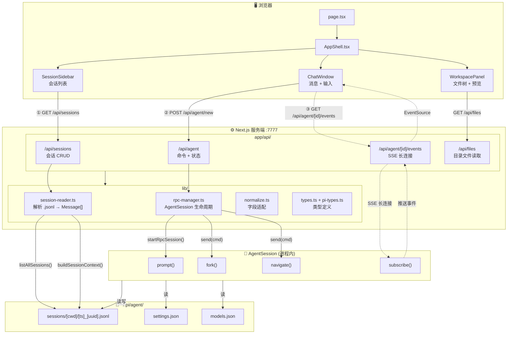
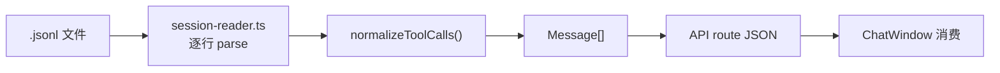
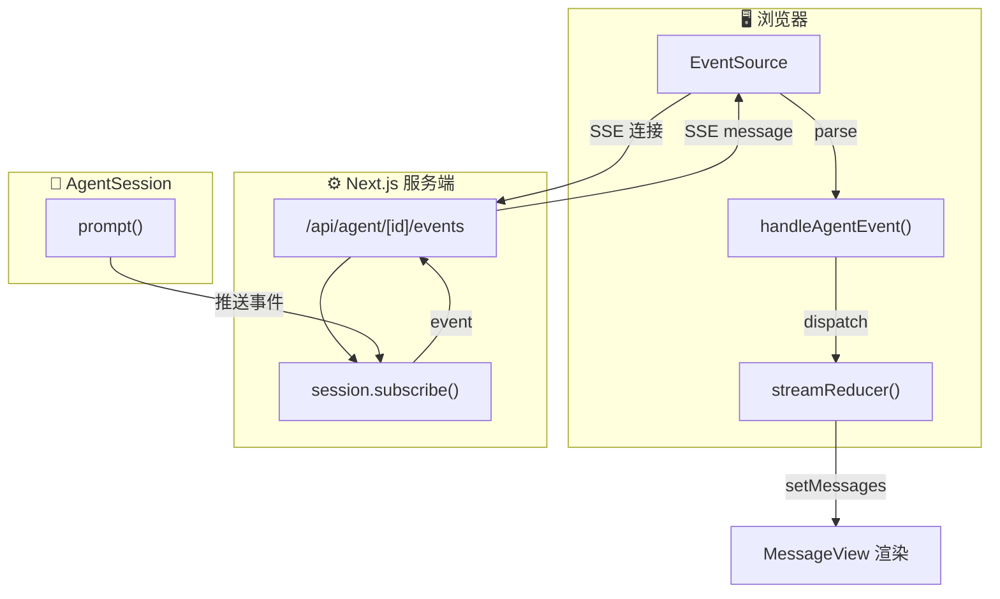
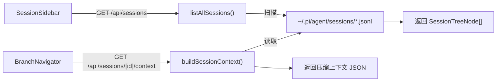
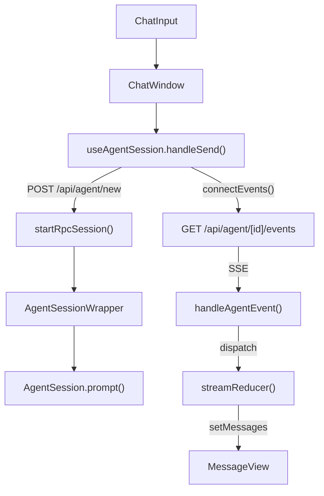
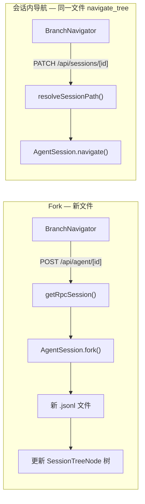
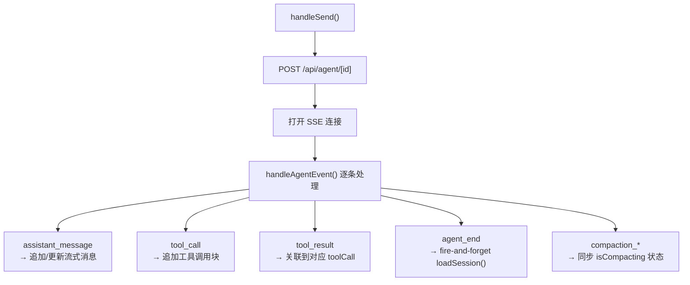
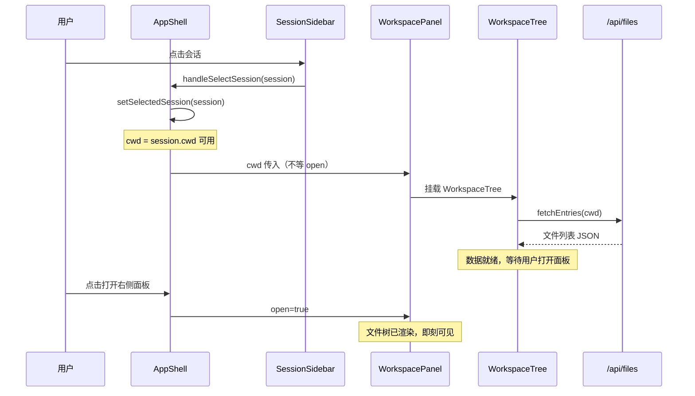

# ROADMAP

> [!abstract] 阅读路线
> 由远到近理解 pi-web：**架构 → 持久层 → API/通信 → 数据流 → 状态 → UI**。
> 首选深读 §2（四层架构图）和 §5（三条数据流），其余章节按需查阅。

---

## 1. 项目定位

pi-web 是 [pi 编程智能体](https://github.com/badlogic/pi-mono) 的 Web 界面。它本身不实现智能体逻辑——智能体由 `@earendil-works/pi-coding-agent` 提供，pi-web 负责：

- 在浏览器中 ==展示== 本地 `.jsonl` 会话文件
- 通过 ==进程内 RPC== 驱动 AgentSession，将事件 ==流式转发== 到浏览器
- 提供 ==会话管理== UI（分叉、分支、压缩等）

> [!note] 核心约束
> pi-web **不实现智能体逻辑**。所有 AI 能力来自进程内 `AgentSession`，pi-web 只是它的 Web 外壳。

---

## 2. 架构总览

### 2.1 四层架构



### 2.2 三条数据流

| 流 | 协议 | 方向 | 核心模块 | 触发者 |
|---|---|---|---|---|
| ① 浏览流 | HTTP GET | 服务端→浏览器 | `session-reader.ts` | `SessionSidebar`, `BranchNavigator` |
| ② 对话流 | HTTP POST | 浏览器→服务端→Agent | `rpc-manager.ts` | `ChatInput` |
| ③ 事件流 | SSE | Agent→服务端→浏览器 | `rpc-manager.ts` + `useAgentSession` | `ChatWindow` |

### 2.3 文件地图

```
pi-web/
├── bin/pi-web.js              CLI 入口，spawn Next.js
├── app/
│   ├── layout.tsx             RootLayout
│   ├── page.tsx               Home → AppShell
│   ├── globals.css            全局样式 + CSS 变量
│   └── api/                   路由处理器
│       ├── sessions/          会话 CRUD
│       ├── agent/             RPC 代理 + SSE
│       ├── files/             文件系统读取
│       ├── models/            模型配置
│       └── skills/            技能列表
├── components/                UI 组件
│   ├── AppShell.tsx           布局骨架
│   ├── ChatWindow.tsx         聊天主区（最复杂）
│   ├── ChatInput.tsx          输入框 + 文件拖拽
│   ├── MessageView.tsx        消息渲染入口
│   ├── SessionSidebar.tsx     左侧会话列表
│   ├── WorkspacePanel.tsx     右侧工作区面板
│   ├── WorkspaceTree.tsx      文件树组件
│   └── ...
├── hooks/
│   ├── useAgentSession.ts     核心状态机（最复杂 hook）
│   ├── useChatScroll.ts       虚拟滚动
│   └── useTheme.ts            主题切换
└── lib/
    ├── session-reader.ts      文件解析器（只读路径核心）
    ├── rpc-manager.ts         AgentSession 生命周期
    ├── types.ts               UI 类型定义
    ├── pi-types.ts            pi 原生类型
    ├── normalize.ts           字段适配
    └── ...
```

---

## 3. 持久层与数据模型

### 3.1 存储格式

pi 把每个会话存为一个 `.jsonl` 文件，一行一条 entry：

```
~/.pi/agent/sessions/<编码后的工作目录>/<时间戳>_<uuid>.jsonl
```

每条 entry 的结构由 `lib/pi-types.ts` 定义（pi 原生格式）。

### 3.2 类型层次

```
lib/pi-types.ts        pi 原生类型（.jsonl entry 结构）
     │
     ▼
lib/types.ts           前端 UI 类型（Message、ToolCallContent 等）
     │
     ▼
lib/normalize.ts       字段名适配层
```

> [!important] 关键适配
> pi 存的是 `{type:"toolCall", id, name, arguments}`，UI 组件用的是 `{toolCallId, toolName, input}`。`normalizeToolCalls()` 在数据入口统一转换。

### 3.3 会话读取器



> [!tip] 只读路径
> `session-reader.ts` 不创建 AgentSession，不产生副作用。只有「发送消息」才会触发 AgentSession 创建。

---

## 4. API 与通信层

### 4.1 核心：rpc-manager.ts

```
lib/rpc-manager.ts
  └─ globalThis.__piSessions: Map<sessionId, AgentSessionWrapper>
  └─ globalThis.__piStartLocks: Map<sessionId, Promise>   // 防并发重复创建
```

> [!warning] globalThis 必须
> 不能用模块级 Map 存 AgentSession——Next.js 热重载会重置模块变量但 `globalThis` 存活。
> 每个会话 ID 一个 `AgentSessionWrapper`，空闲 10 分钟自动销毁。
> 并发 `startRpcSession()` 共享同一个启动 Promise，避免重复创建。

### 4.2 API 路由

```
会话读写
  GET    /api/sessions             列表（按工作目录分组）
  GET    /api/sessions/[id]        单个会话内容
  DELETE /api/sessions/[id]        删除会话
  PATCH  /api/sessions/[id]        更新 parentSession 关联
  POST   /api/sessions/new         创建新会话

Agent 交互
  POST   /api/agent/[id]           发送命令（prompt / fork / interrupt）
  GET    /api/agent/[id]           查询状态（isStreaming / thinkingLevel / isCompacting）
  GET    /api/agent/[id]/events    SSE 事件流
  POST   /api/agent/new           验证工作目录 + 创建新 AgentSession

配置
  GET    /api/models               可用模型列表
  GET    /api/home                 用户主目录
  POST   /api/models-config        编辑 models.json
  GET    /api/files/[...path]      读取工作目录文件
```

### 4.3 SSE 事件流

`api/agent/[id]/events` 维持长连接，AgentSession 通过 `session.subscribe()` 推送事件。前端 `useAgentSession` hook 解析事件并更新消息列表。



---

## 5. 数据流全景

pi-web 有三条独立的数据流路径，交汇于 `.jsonl` 文件和 `session-reader.ts`。

### 5.1 浏览流（只读）



> [!tip] 纯文件读取
> ==不创建 AgentSession==，`session-reader.ts` 是这条路径的核心。

### 5.2 对话流（写 + 流式）



**rpc-manager.ts** 管理进程内 AgentSession 生命周期。前端 `useAgentSession` hook 解析 SSE 事件并逐条更新消息列表。

### 5.3 导航流（分支）



> [!info] 两种分支
> Fork 创建 ==新 `.jsonl` 文件==，会话内导航在同一文件内跳转（`navigate_tree`）。详见 §8.2。

---

## 6. 状态管理

### 6.1 useAgentSession（hooks/useAgentSession.ts）

最复杂的 hook，管理 Agent 交互的完整状态机：



> [!warning] 关键竞态
> `agent_end` 中 `loadSession()` 是异步的，直接 `setMessages()` 会与下一次 `handleSend` 竞态导致消息丢失。用 ==`loadGenRef` 版本计数器==守卫——gen 不匹配则丢弃结果。

### 6.2 其他 hooks

| Hook | 职责 |
|---|---|
| `useChatScroll` | 自动跟底 vs 手动上滚检测 |
| `useTheme` | 深色/浅色模式 |
| `useAudio` | 消息通知音效 |
| `useDragDrop` | 文件拖拽上传 |

---

## 7. UI 组件

### 7.1 骨架

```
AppShell
├── SessionSidebar         左侧边栏
│   ├── WorkspacePanel     工作区面板
│   │   └── WorkspaceTree  文件树（cwd 确定即挂载，不等面板打开）
│   └── SessionList        会话列表（含 fork 树）
├── ChatWindow             主聊天区
│   ├── MessageView[]      消息列表（Virtuoso 虚拟滚动）
│   ├── ChatInput          输入框
│   └── ChatMinimap        右侧缩略导航
├── ModelsConfig           模型配置面板
├── SkillsConfig           技能配置面板
└── ToolPanel              工具开关面板
```

### 7.2 ChatWindow（components/ChatWindow.tsx）

最复杂的组件，两个核心问题：

> [!bug] 滚动性能
> `atBottomStateChange` 回调中直接 `setState` 会导致每次像素滚动触发全量重渲染。用 ref 守卫只做 `true↔false` 转换。

> [!tip] 滚动源冲突
> `useEffect` 依赖 streaming 对象（~60fps 变化）导致 effect 高频重建并与用户手动滚动竞争。改用 ==单一 rAF 循环==（仅依赖 `agentRunning`），每帧从 ref 读取状态。

### 7.3 组件挂载时序



### 7.4 MessageView（components/MessageView.tsx）

消息渲染入口，按类型分发：
- `UserMessage` → `UserMessageView`（含 Fork 按钮、编辑重发）
- `AssistantMessage` → Markdown 渲染 + ToolCall 折叠组
- `ToolCall` → `ToolCallsGroup`（可折叠工具调用组，支持跨消息合并）

---

## 8. 关键陷阱

> [!danger] 1. Fork 后必须销毁 wrapper
> `fork()` 原地修改 `sessionId`，不销毁会导致下次请求拿到已 fork 的状态。

> [!warning] 2. 两种分支不同
> Fork（==新 `.jsonl` 文件==）vs 会话内分支（==同一文件 `navigate_tree`==），见 §5.3。

> [!important] 3. ToolCall 字段规范化 — 两处都要调用
> 在 `session-reader`（文件加载）和 `handleAgentEvent`（流式传输）==两处==都要调用 `normalizeToolCalls()`。

> [!warning] 4. `agent_end` 竞态
> `loadGenRef` 版本计数器，见 §6.1。

> [!bug] 5. Virtuoso 滚动
> ref 守卫 + rAF 循环，见 §7.2。

> [!warning] 6. `globalThis` 必须
> 不能用模块级变量存 AgentSession，Next.js 热重载会重置，见 §4.1。

> [!info] 7. 压缩事件双版本
> pi 新版发 `compaction_start/end`，旧版发 `auto_compaction_start/end`，两套都要处理。
