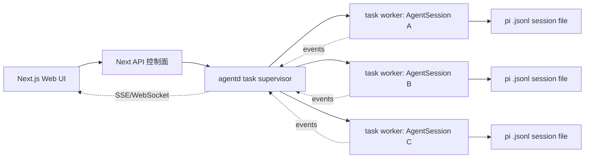

# TODO.md

## 背景语义
 
当前的改进方向是强化自身设计哲学：

- 会话即文件：`.jsonl` 是可读、可重建、可迁移的事实源。
- 运行态独立：进行中的 Agent 不应只依附当前 ChatWindow；`TaskSession` 是运行事实源，`.jsonl` 是历史事实源。
- 上下文可追溯：用户应能理解当前消息、工具调用、文件引用与分支位置之间的关系。
- 分支可解释：必须明确区分文件级 Fork 与同文件内 `navigate_tree` 分支。
- 工具可控：工具预设、禁用工具、压缩状态、流式状态都应在 UI 中可见、可解释。

后续 AI 修改时，不要把这些 TODO 理解为单纯 UI 美化。目标是让用户更清楚地理解：

1. 我现在在哪个会话/分支上？
2. 这条回答来自哪些上下文与工具调用？
3. 当前文件树和聊天流之间有什么关系？
4. 当前 Agent、模型、工具和 SSE 连接处于什么状态？
5. 哪些任务正在后台运行，切换回来后能否继续接上事件流？

## UI / 交互原则

目标是体验一致性，不复制其他产品的信息架构。no-pi-no-gang 仍以 `.jsonl` 会话文件、AgentSession 和本地工作目录为事实源；后续架构应把 AgentSession 从 Next.js UI 进程中逐步剥离为独立 task runtime。

- 三栏工作区：左侧任务/会话入口，中间对话执行流，右侧文件/上下文工作台；三栏各自有清晰职责，不互相塞功能。
- 任务一等公民：一个进行中会话对应一个 `TaskSession`，允许多个后台任务并行运行、互切、重连。
- 状态优先但低噪音：运行中、工具调用、压缩、SSE 重连、无工具模式等状态应可见，但默认只给短标签或状态条，细节放展开层。
- 工具调用可审计：工具名、输入摘要、结果摘要、失败原因、耗时/状态应像执行记录一样可扫读。
- 文件与消息联动：从聊天消息能定位到相关文件，从文件能回看相关消息或工具调用，减少“这段回答基于哪里”的断裂感。
- 分支语义明确：用户必须能一眼区分“新会话文件 Fork”和“同一会话内切换分支路径”。
- 配置就地反馈：模型、工具、技能配置修改后，界面要明确显示作用范围是“后续请求”，不要让用户误以为历史消息被重写。
- 错误态可恢复：断线、会话销毁、文件不可读、cwd 越界、配置写入失败都应给下一步动作，而不是只显示失败。

边界约束：

- 不把 no-pi-no-gang 做成通用 IDE；文件区先服务上下文追溯，不优先做复杂编辑器。
- 不隐藏 `.jsonl` 文件事实源；会话文件、父子关系、孤立状态都应保留可解释性。
- 不用大面积调试信息占满聊天流；主路径保持阅读顺滑。

## 权重规则

权重用于决定迭代优先级，范围为 40-100：

- 90-100：P0，影响核心语义或会话正确性，优先做。
- 75-89：P1，显著提升可理解性或可靠性，排在 P0 后。
- 60-74：P2，补齐配置、工作台、错误态等体验能力。
- 40-59：P3，增强维护、诊断和细节体验，不阻塞主路径。

## 特性总览

| 特性维度 | 权重 | 状态 | 待补齐能力 |
|---|---:|---|---|
| 会话谱系与 cwd 视角 | 100 | 部分已有 | 父子树、cwd 过滤、孤立状态、会话节点元数据 |
| Task Session 并发运行架构 | 98 | 新增规划 | task runtime、后台多任务、事件回放、Next 控制面瘦身 |
| Fork / Branch 语义 | 95 | 部分已有 | 文件级 Fork 与同文件分支的 UI 区分、来源说明、验证防串线 |
| Chat 执行流可审计 | 92 | 部分已有 | 消息锚点、当前路径标记、SSE/compaction/thinking 状态栏 |
| Tool call 与压缩时间线 | 86 | 部分已有 | 可扫读摘要、失败原因、压缩事件时间线 |
| 文件上下文工作台 | 80 | 基础已有 | Context Stack、消息-文件双向关联、引用文件标记 |
| Agent 生命周期可靠性 | 78 | 基础已有 | wrapper 状态可见、重连恢复、异常会话修复入口 |
| 模型、工具与技能配置 | 68 | 基础已有 | 配置变更反馈、无工具模式说明、预设快照 |
| 项目入口与文件错误态 | 62 | 基础已有 | cwd 外/删除/不可读文件状态、启动端口文档一致性 |
| 可观测性与回归验证 | 55 | 薄弱 | 最小验证清单、状态机用例、文档与图谱同步 |

## 按权重排序的 Task 包

这些 Task 包按“模块边界 + 体验一致性”收录代办。后续迭代优先选完整 Task 包，不要跨多个包顺手改无关代码。

### Task 1：会话定位与分支语义统一

权重：100，P0。

模块范围：

- `components/SessionSidebar.tsx`
- `components/BranchNavigator.tsx`
- `components/MessageView.tsx`
- `components/ChatWindow.tsx`
- `lib/session-reader.ts`
- `lib/rpc-manager.ts`
- `app/api/sessions/*`
- `app/api/agent/[id]/route.ts`

体验一致性目标：

- 左侧会话树、消息锚点、BranchNavigator 对同一个会话/分支状态给出一致解释。
- Fork 一律表达为“创建新会话文件”；BranchNavigator 一律表达为“当前文件内路径切换”。
- 孤立会话、父会话缺失、当前 cwd 过滤不让用户迷路。

AI 可执行粒度：

- [x] 确认左侧分支整合方案：第一版按 `cwd -> session -> branch` 组织，Fork 子会话是主层级，同文件 leaf branch 只显示在当前选中 session 下。
- [x] 将顶部 BranchNavigator 和 ChatInput 分支下拉移入左侧 SessionSidebar，顶部不再保留第二个分支入口。
- [ ] 给会话节点补齐 `parentSession`、`cwd`、`updatedAt`、`model`、`orphaned`、`isStreaming`、`hasCompaction` 的最小可用字段。
- [ ] 复用 `buildSessionTree()` 做默认父子树展示，并加“当前 cwd / 按 cwd 分组 / 全部”视角切换。
- [ ] Fork 按钮、Fork 结果提示、子会话节点文案统一说明“新 `.jsonl` 会话文件”。
- [ ] BranchNavigator 文案统一说明“同一 `.jsonl` 内分支路径”。
- [ ] 消息锚点显示 `entryId`、当前 leaf/branch、是否在当前路径上。

已确认的左侧分支 UI 规则：

- 一级结构固定为 `cwd -> session -> branch`。
- `session` 树表达文件级 Fork：使用 `parentSessionId` / `buildSessionTree()` 组织父子会话。
- 当前选中 session 下才显示同文件 leaf branch；其他 session 不批量读取详情、不显示 leaf。
- leaf branch 只显示分叉后的可选路径；线性消息链必须压缩，不能逐条消息渲染成重复 branch 节点。
- 默认全折叠；打开或刷新当前 session 时，自动展开当前 session 的祖先链。
- 点击 session 行主体切换 session；点击 chevron 只展开/折叠；点击 leaf 行只切换 leaf，不 remount session。
- streaming 中禁用 leaf 切换，避免 `navigate_tree` 与正在生成的上下文串线。
- 无 fork、无 leaf 分支的 session 只显示普通 session 行，不显示空 branch 容器。
- 不显示 fork 数量或 branch 数量 badge，保持左侧简洁。
- 当前选中 session 的元信息行显示新增 branch 数，不包含原始路径。
- leaf 行文案只显示现有 label，不附加短 id、时间或摘要。
- 第一版只改前端 UI，不改 API、存储或 `.jsonl` 结构。

验收：

- 用户能从左侧树和中间消息同时判断自己在哪个会话、哪个分支。
- Fork 后旧会话继续请求不会串到新 wrapper。
- 当前 cwd 过滤不会隐藏当前打开会话。

### Task 2：Task Session 并发运行架构

权重：98，P0。

模块范围：

- `lib/rpc-manager.ts`
- `hooks/useAgentSession.ts`
- `components/AppShell.tsx`
- `components/SessionSidebar.tsx`
- `app/api/agent/[id]/route.ts`
- `app/api/agent/[id]/events/route.ts`
- 建议新增：task registry / task runtime / task event store；命名落地前先确认现有文件边界。

体验一致性目标：

- Next.js 负责 Web UI 和控制面，不继续把长期运行的 AgentSession 当成 API Route 内部状态。
- `.jsonl` 继续作为历史事实源；`TaskSession` 作为运行事实源，描述 `running / idle / failed / aborted` 等状态。
- 一个进行中会话可以单独拉起一个 task session；多个 task 可以并行运行，用户在会话间互切不丢事件。

AI 可执行粒度：

- [ ] 定义最小 `TaskSession` 数据模型：`taskId`、`piSessionId`、`sessionFile`、`cwd`、`status`、`startedAt`、`updatedAt`、`lastEventSeq`、`lastError`。
- [ ] 短期先把当前 `globalThis.__piSessions` 包装成 task registry，不改变 pi SDK 调用方式，只把运行态从 ChatWindow 状态提升到全局任务状态。
- [ ] 中期新增独立 `agentd`/worker runtime：Next API 只发命令和订阅事件，pi SDK 在独立 Node 进程中运行。
- [ ] 每个进行中会话对应独立 worker 或可隔离 runtime；任务崩溃只影响当前 task，不拖垮 Next Web 服务。
- [ ] 事件流增加 `seq` 和可回放缓冲：切换回来先按 `lastEventSeq` 补事件，再接 live SSE。
- [ ] SSE route 只订阅 task 事件，不在 GET 事件流时隐式创建 AgentSession；创建由 `POST /api/tasks` 或发送消息路径负责。
- [ ] agent routes 显式声明 `runtime = "nodejs"` 和动态响应，避免 Node SDK、进程状态、长连接依赖隐式默认值。

验收：

- 同时启动两个会话任务，切到任意会话都能看到各自独立的运行状态。
- 切走正在 streaming 的会话不 abort；切回来能补齐缺失事件并继续 live。
- Next dev 热重载或 ChatWindow remount 不应直接丢失 task 状态；如果 task runtime 不可恢复，UI 必须明确显示原因。
- 只读打开历史会话仍不创建 AgentSession。

### Task 3：Chat 执行流与运行状态条

权重：92，P0。

模块范围：

- `components/ChatWindow.tsx`
- `components/ChatInput.tsx`
- `hooks/useAgentSession.ts`
- `app/api/agent/[id]/route.ts`
- `app/api/agent/[id]/events/route.ts`

体验一致性目标：

- 中间聊天区保持主内容干净，但顶部状态条能解释当前运行状态。
- SSE、compaction、thinking、无工具模式都在同一个状态语言里表达。

AI 可执行粒度：

- [ ] Chat 顶部增加轻量状态条：`streaming`、`compacting`、`thinkingLevel`、SSE 连接状态。
- [ ] 进入会话时先查询 `/api/agent/[id]`，再决定是否接 SSE。
- [ ] SSE 断线时区分“正在重连 / 会话已销毁 / 当前只读浏览”。
- [x] ChatInput 在工具全禁用时显示”无工具模式”，不阻止普通发送。
- [x] 保留 `agent_end` 后 `loadSession()` 的版本守卫，防止旧加载覆盖新消息。

验收：

- 刷新 streaming 会话后状态能恢复或明确显示不可恢复原因。
- compaction 开始/结束状态不残留。
- 快速连续发送不会丢消息。

### Task 4：Tool call、压缩与执行记录一致性

权重：86，P1。

模块范围：

- `components/MessageView.tsx`
- `components/ChatWindow.tsx`
- `components/ToolPanel.tsx`
- `hooks/useAgentSession.ts`
- `lib/normalize.ts`
- `lib/types.ts`

体验一致性目标：

- 工具调用像执行日志一样可扫读，默认折叠但保留关键信息。
- 压缩事件进入聊天时间线，和工具调用共享一致的状态表达。

AI 可执行粒度：

- [x] Tool call 摘要统一展示工具名、状态、输入摘要、结果摘要、失败原因。
- [x] 文件加载和流式事件两处都经过 `normalizeToolCalls()`。
- [x] 同时支持 `compaction_start/end` 和 `auto_compaction_start/end`。
- [ ] Tool call 失败优先展示结构化错误；没有结构化错误时提供展开入口。
- [ ] 连续工具调用合并展示时保留原始消息边界和 `entryId` 归属。

验收：

- 失败工具调用不展开也能识别失败原因。
- 折叠/展开不破坏虚拟列表滚动和复制按钮。
- 新旧压缩事件都能正确闭环。

### Task 5：右侧文件上下文工作台

权重：80，P1。

模块范围：

- `components/WorkspacePanel.tsx`
- `components/WorkspaceTree.tsx`
- `components/FileExplorer.tsx`
- `components/FileViewer.tsx`
- `components/TabBar.tsx`
- `components/ChatWindow.tsx`
- `components/MessageView.tsx`
- `app/api/files/[...path]/route.ts`

体验一致性目标：

- 右侧不是普通文件浏览器，而是当前会话上下文工作台。
- 文件、消息、工具调用之间可以互相定位，但第一阶段只做可靠来源，不靠脆弱字符串猜测。

AI 可执行粒度：

- [ ] 文件树标记当前会话可靠引用过的文件。
- [ ] 增加 Context Stack：手动打开文件、最近 tool call 文件、当前会话相关文件。
- [ ] 先做消息到文件的单向跳转：点击消息高亮相关文件。
- [x] FileViewer 区分当前内容、diff、agent 引用片段；第一阶段可只落当前内容和错误态。
- [ ] 明确展示 cwd 外、已删除、不可读、二进制不支持四类文件状态。

验收：

- 切换会话后 Context Stack 跟随刷新。
- 当前会话引用标记不会误标全项目文件。
- 文件读取错误不导致工作区崩溃。

### Task 6：配置面板与作用范围反馈

权重：68，P2。

模块范围：

- `components/ModelsConfig.tsx`
- `components/ToolPanel.tsx`
- `components/SkillsConfig.tsx`
- `components/ChatInput.tsx`
- `app/api/models/route.ts`
- `app/api/models-config/route.ts`
- `app/api/skills/route.ts`

体验一致性目标：

- 模型、工具、技能配置都要显示当前状态、保存反馈和作用范围。
- 配置变更只影响后续请求，不重写历史消息语义。

AI 可执行粒度：

- [ ] 模型配置保存显示成功、失败、字段校验错误三种状态。
- [x] Chat 状态条或会话节点显示当前模型；无历史元数据时只显示默认模型。
- [x] ToolPanel 显示全部可用、部分禁用、全部禁用三种预设快照。
- [x] SkillsConfig 区分空列表、加载中、加载失败。
- [ ] 配置变更提示“对后续请求生效”。

验收：

- models.json 写入失败有明确错误。
- 无工具模式和部分禁用模式视觉可区分。
- 切换模型后历史消息不被重标。

### Task 7：入口、错误态与回归验证

权重：62，P2。

模块范围：

- `bin/no-pi-no-gang.js`
- `app/api/home/route.ts`
- `app/api/files/[...path]/route.ts`
- `components/FileViewer.tsx`
- `README.md`
- `AGENTS.md`
- `docs/`

体验一致性目标：

- 启动、cwd、文件读取、验证命令都给稳定反馈。
- 后续 AI 能按同一套验收标准改动，不靠猜。

AI 可执行粒度：

- [ ] 统一端口文档为 `npm run dev` 端口 7777。
- [ ] 新建会话工作目录校验失败时区分路径不存在、无权限、不是目录。
- [x] 文件 API 新增能力时继续保持 cwd 边界检查。
- [ ] 维护会话树、Fork、Branch、SSE、compaction、ToolCall 的手动验证清单。
- [ ] 对 `normalizeToolCalls()` 增加最小测试或可运行样例。

验收：

- 文档端口一致。
- cwd 外路径读取失败且不泄露内容。
- `node_modules/.bin/tsc --noEmit` 通过。

## 1. 会话谱系与 cwd 视角

权重：100，P0。

### 目标

左侧不只是历史聊天入口，而是任务演化图。用户需要看到会话之间的父子关系、fork 来源、当前项目范围和异常会话状态。

### 可能涉及模块

- `components/SessionSidebar.tsx`
- `components/AppShell.tsx`
- `lib/session-reader.ts`
- `app/api/sessions/route.ts`
- `app/api/sessions/[id]/route.ts`
- `lib/types.ts`

### AI 可执行任务

- [ ] 补齐会话节点元数据：在 `SessionInfo` 或 API 返回值中确认是否已有 `model`、`cwd`、`updatedAt`、`parentSession`、`orphaned`、`isStreaming`、`hasCompaction`；缺哪个先补最小字段，不引入索引层。
- [ ] 默认以父子树展示会话：复用现有 `buildSessionTree()`，让 `parentSession` 子节点稳定嵌套；根节点仍按最近更新时间排序。
- [ ] 增加 cwd 视角切换：实现“只看当前 cwd / 按 cwd 分组 / 全部会话”，并保证当前打开会话不会被过滤到不可见。
- [ ] 给孤立会话加明确状态：保留不可点击策略，节点上显示“源会话缺失”或等价状态，不改变选择逻辑。
- [ ] 给 fork 子会话显示来源文案：优先使用可确定的父会话和用户消息摘要；拿不到消息摘要时只显示“来自父会话 fork”，不要猜测。

### 验证点

- 有父子关系的会话能正确嵌套显示。
- 孤立会话仍不可点击，且有明确状态。
- 当前项目过滤不会隐藏当前打开会话。
- 删除或重新关联会话后，树结构刷新正确。

## 2. Task Session 并发运行架构

权重：98，P0。

### 目标

把“历史会话文件”和“正在运行的任务”拆开建模：`.jsonl` 继续记录可恢复历史，`TaskSession` 记录正在运行、可互切、可重连的 Agent 执行状态。Next.js 应逐步退回 Web UI 和控制面，pi-Agent SDK 不再长期依赖 API Route 内的 `globalThis`。

### 推荐架构

### 可能涉及模块

- `lib/rpc-manager.ts`
- `hooks/useAgentSession.ts`
- `components/AppShell.tsx`
- `components/SessionSidebar.tsx`
- `components/ChatWindow.tsx`
- `app/api/agent/[id]/route.ts`
- `app/api/agent/[id]/events/route.ts`
- `bin/no-pi-no-gang.js`
- 建议新增：task registry、task event store、agentd/worker runtime；新增文件名前先确认边界，避免把一次实验写成永久抽象。

### AI 可执行任务

- [ ] 先写最小 `TaskSession` 类型草案：`taskId`、`piSessionId`、`sessionFile`、`cwd`、`status`、`startedAt`、`updatedAt`、`lastEventSeq`、`lastError`。
- [ ] 短期过渡：保留当前进程内 pi SDK 调用，把 `globalThis.__piSessions` 外面包一层 task registry；前端按 task 状态显示多个运行中会话。
- [ ] 中期重构：把 task registry 和 `AgentSessionWrapper` 搬出 Next API Route，放到独立 `agentd` 进程；Next API 只负责命令转发、状态读取和事件订阅。
- [ ] worker 隔离：一个进行中会话至少有独立 task runtime；优先评估 `child_process.fork()`，因为 Agent 会跑 bash、读写文件、持有模型连接，进程隔离比 worker thread 更稳。
- [ ] 事件流可回放：所有 agent event 增加单调 `seq`，保留内存 ring buffer 或轻量 `task-events/<taskId>.jsonl`；切换回来按 `lastEventSeq` 补齐事件再接 live。
- [ ] API 语义拆分：创建/发送消息路径负责启动 task；`GET /events` 只订阅已有 task，不隐式创建 AgentSession。
- [ ] 明确 Node runtime：涉及 pi SDK、文件系统、长连接的 route 显式声明 `runtime = "nodejs"` 和动态响应。
- [ ] UI 状态提升：`agentRunning` 不再只是当前 ChatWindow 局部状态；左侧会话树和顶部状态条都能看到多个 task 的运行状态。

### 验证点

- 同时启动两个会话任务，二者状态、事件和 abort 互不串线。
- 切走 streaming 会话不会 abort；切回来能补齐缺失事件并继续 live。
- ChatWindow remount 不丢 task 状态；如果 task runtime 不可恢复，UI 明确显示原因。
- 只读打开历史会话仍不创建 AgentSession。
- agentd/worker 方案落地前，不能删除 `.jsonl` 作为历史事实源。

## 3. Fork / Branch 语义

权重：95，P0。

### 目标

明确区分两种分支：Fork 创建新的独立 `.jsonl` 会话文件；Continue / BranchNavigator 在同一个文件内调用 `navigate_tree` 切换分支。

### 可能涉及模块

- `components/BranchNavigator.tsx`
- `components/ChatWindow.tsx`
- `components/MessageView.tsx`
- `hooks/useAgentSession.ts`
- `lib/rpc-manager.ts`
- `app/api/agent/[id]/route.ts`
- `app/api/sessions/[id]/context/route.ts`

### AI 可执行任务

- [ ] 在 Fork 按钮附近补语义提示：文案必须说明会创建新会话文件，不要写成“切换分支”。
- [ ] 在 BranchNavigator 附近补同文件分支提示：文案必须说明这是当前 `.jsonl` 内的路径切换。
- [ ] Fork 成功后刷新会话树并选中新会话：确认 `fork()` 后旧 wrapper 被销毁，避免旧会话后续请求复用已改写状态。
- [ ] 分支切换后同步消息路径：确认消息列表、`entryIds`、当前 leaf、BranchNavigator 状态来自同一次 `buildSessionContext()`。
- [ ] 在消息锚点中标记“当前路径上/非当前路径”：只展示轻量标记，细节放展开层。

### 验证点

- Fork 后原会话再次请求不会复用已被 fork 改写内部状态的 wrapper。
- 同文件内分支切换后，消息、entryIds、BranchNavigator 状态一致。
- 用户能从 UI 文案区分 Fork 和 Continue。

## 4. Chat 执行流可审计

权重：92，P0。

### 目标

Chat 区保持顺滑阅读，同时让用户知道当前回答处在哪条执行路径上，以及 SSE、压缩、thinking 状态如何影响当前上下文。

### 可能涉及模块

- `components/ChatWindow.tsx`
- `components/MessageView.tsx`
- `components/ChatInput.tsx`
- `hooks/useAgentSession.ts`
- `lib/normalize.ts`
- `lib/types.ts`
- `app/api/agent/[id]/route.ts`
- `app/api/agent/[id]/events/route.ts`

### AI 可执行任务

- [ ] 在 Chat 顶部增加轻量状态条：显示 `streaming`、`compacting`、`thinkingLevel`、SSE 连接状态；没有状态时不占主视觉。
- [ ] 页面刷新后恢复运行状态：进入会话时先查 `/api/agent/[id]`，再决定是否接 SSE；不要只依赖前端内存状态。
- [ ] 消息附近显示上下文锚点：至少包含 `entryId`、`leafId` 或 branch 信息、是否当前路径。
- [x] ChatInput 在无工具模式下显示状态：当工具完全禁用时，输入区显示”无工具模式”，但不阻止普通消息发送。
- [ ] `agent_end` 后加载会话继续使用版本守卫：不要移除 `loadGenRef` 这类防竞态机制。

### 验证点

- streaming 中刷新页面可以自动重连或明确显示不可重连状态。
- compaction 开始和结束状态能正确恢复。
- 无工具模式下新会话仍能发送消息。
- 快速连续发送不会被旧 `loadSession()` 覆盖新消息。

## 5. Tool call 与压缩时间线

权重：86，P1。

### 目标

工具调用默认折叠，但摘要必须可扫读；压缩事件要进入执行时间线，而不是只表现为按钮禁用或 spinner。

### 可能涉及模块

- `components/MessageView.tsx`
- `components/ChatWindow.tsx`
- `components/ToolPanel.tsx`
- `hooks/useAgentSession.ts`
- `lib/normalize.ts`
- `lib/types.ts`

### AI 可执行任务

- [x] Tool call 摘要统一字段：工具名、状态、输入摘要、结果摘要、失败原因。
- [x] 确认文件加载和流式事件两处都调用 `normalizeToolCalls()`；不要直接假设 pi 原始字段等于 UI 字段。
- [x] 将 `compaction_start` / `compaction_end` 写入可见时间线；同时兼容旧版 `auto_compaction_start` / `auto_compaction_end`。
- [ ] Tool call 失败时展示失败原因：优先用结构化错误字段；没有结构化字段时只显示“失败，详情见展开内容”。
- [ ] 合并连续工具调用组时保留消息边界：跨消息合并只能影响展示，不要丢失原始 `entryId` 归属。

### 验证点

- Tool call 折叠状态不影响复制消息、滚动定位和虚拟列表高度稳定性。
- 新旧 compaction 事件都能开始和结束。
- 失败工具调用能被扫读识别，不需要展开全文。

## 6. 文件上下文工作台

权重：80，P1。

### 目标

右侧文件区不只是打开文件，而是展示 agent 实际使用过、用户正在查看、以及当前会话上下文相关的文件集合。

### 可能涉及模块

- `components/WorkspacePanel.tsx`
- `components/WorkspaceTree.tsx`
- `components/FileExplorer.tsx`
- `components/FileViewer.tsx`
- `components/TabBar.tsx`
- `components/ChatWindow.tsx`
- `components/MessageView.tsx`
- `app/api/files/[...path]/route.ts`
- `lib/types.ts`

### AI 可执行任务

- [ ] 文件树中标记当前会话引用过的文件：只使用可靠来源；没有结构化文件引用时不要大规模字符串猜测。
- [ ] 增加 Context Stack：至少包含用户手动打开的文件、最近 tool call 涉及的文件、当前会话上下文相关文件。
- [ ] 建立消息到文件的单向跳转：点击消息高亮相关文件；先做这一半，再考虑文件到消息反查。
- [x] FileViewer 增加基础视图切换：当前内容、diff、agent 引用片段；第一阶段可以只实现当前内容和错误态。
- [ ] 对 cwd 外文件、已删除文件、不可读文件给明确状态，不要静默失败。

### 验证点

- 打开文件标签不会破坏 Chat 标签。
- 删除或不可读文件在 FileViewer 中有明确错误态。
- 当前会话引用文件的标记不会误标全项目文件。
- 切换会话后，Context Stack 随会话更新。

## 7. Agent 生命周期可靠性

权重：78，P1。

### 目标

作为 Task Session 重构前的过渡层，让用户和后续 AI 都能判断当前会话对应的进程内 AgentSession 是否存在、是否运行、是否可恢复。

### 可能涉及模块

- `lib/rpc-manager.ts`
- `hooks/useAgentSession.ts`
- `app/api/agent/[id]/route.ts`
- `app/api/agent/[id]/events/route.ts`
- `components/ChatWindow.tsx`

### AI 可执行任务

- [ ] 补一个轻量 Agent 状态读取：前端进入会话时能看到 `exists`、`isStreaming`、`isCompacting`、`thinkingLevel`、最后更新时间。
- [ ] SSE 断线时区分“可重连”和“会话已空闲销毁”：避免一直显示运行中。
- [ ] 空闲销毁后允许从文件态继续：只读浏览不创建 AgentSession，发送消息才创建。
- [ ] 对并发启动加可观测提示：当 `startRpcSession()` 正在共享启动 Promise 时，UI 不重复触发多次启动。

### 验证点

- 只打开历史会话不会创建 AgentSession。
- 同一会话并发发送不会创建多个 wrapper。
- 空闲销毁后再次发送消息能重新创建会话。

## 8. 模型、工具与技能配置

权重：68，P2。

### 目标

配置区不仅能改值，还要让用户知道当前对话实际使用的模型、工具预设和技能状态。

### 可能涉及模块

- `components/ModelsConfig.tsx`
- `components/ToolPanel.tsx`
- `components/SkillsConfig.tsx`
- `components/ChatInput.tsx`
- `app/api/models/route.ts`
- `app/api/models-config/route.ts`
- `app/api/skills/route.ts`
- `lib/types.ts`

### AI 可执行任务

- [ ] 模型配置保存后给明确反馈：成功、失败、字段校验错误三种状态分开。
- [x] 会话节点或 Chat 状态条显示当前模型：优先取会话元数据；没有时显示默认模型，不要伪造历史使用模型。
- [x] ToolPanel 显示当前工具预设快照：至少区分全部可用、部分禁用、全部禁用。
- [x] SkillsConfig 显示技能加载错误：不要把空列表和加载失败混成一种状态。
- [ ] 配置变更不 retroactively 修改历史消息展示，只影响后续请求。

### 验证点

- models.json 写入失败有错误提示。
- 无工具模式与部分禁用模式视觉可区分。
- 切换模型后新消息使用新配置，历史消息不被重标。

## 9. 项目入口与文件错误态

权重：62，P2。

### 目标

减少启动、工作目录、文件读取相关的误判，让错误状态可见且可恢复。

### 可能涉及模块

- `bin/no-pi-no-gang.js`
- `app/api/home/route.ts`
- `app/api/files/[...path]/route.ts`
- `components/WorkspacePanel.tsx`
- `components/FileViewer.tsx`
- `README.md`
- `AGENTS.md`

### AI 可执行任务

- [ ] 统一开发端口文档：`package.json` 和 `AGENTS.md` 使用 7777，README 不应保留过期端口。
- [x] 文件 API 保持 cwd 边界检查：任何新增文件读取能力都必须继续阻止越权读取。
- [ ] FileViewer 区分 cwd 外、已删除、不可读、二进制不支持四类状态。
- [ ] 新建会话时工作目录校验失败要给可操作错误：显示路径不存在、无权限或不是目录。

### 验证点

- `npm run dev` 文档端口一致。
- cwd 外路径读取失败且不会泄露文件内容。
- 不可读文件不会导致整个工作区崩溃。

## 10. 可观测性与回归验证

权重：55，P3。

### 目标

为后续 AI 迭代提供最小验证标准，避免修 UI 时破坏状态机、流式响应或分支语义。

### 可能涉及模块

- `docs/`
- `hooks/useAgentSession.ts`
- `lib/session-reader.ts`
- `lib/normalize.ts`
- `components/ChatWindow.tsx`
- `components/SessionSidebar.tsx`

### AI 可执行任务

- [ ] 为会话树、Fork、Branch、SSE、compaction、ToolCall 维护一份手动验证清单。
- [ ] 对 `normalizeToolCalls()` 增加最小单元测试或可运行样例，覆盖文件加载和流式事件两种来源。
- [ ] 对 `useAgentSession` 的关键竞态写最小回归用例；不方便自动化时，至少写清复现步骤。
- [ ] 修改架构或 TODO 后，如果项目已有 graphify 图谱且改的是代码路径，运行 `graphify update .`。
- [x] 文档中所有模块路径必须先确认存在，禁止写不存在路径。

### 验证点

- `node_modules/.bin/tsc --noEmit` 通过。
- `node node_modules/next/dist/bin/next lint` 通过或记录既有 lint 问题。
- 文档改动后能用 UTF-8 正常读取。

## 推荐实施顺序

1. 会话谱系与 cwd 视角。
2. Task Session 并发运行架构。
3. Fork / Branch 语义。
4. Chat 执行流可审计。
5. Tool call 与压缩时间线。
6. 文件上下文工作台。
7. Agent 生命周期可靠性。
8. 模型、工具与技能配置。
9. 项目入口与文件错误态。
10. 可观测性与回归验证。

理由：当前最大语义风险不是文件树功能少，而是用户容易混淆文件级 Fork、会话内分支、当前上下文位置和 Agent 运行状态；长期性能和多会话互切风险来自 Next API Route 同时承担 UI 服务和 Agent 运行时。

## 总体验收标准

- 用户不用读源码，也能看懂当前会话、分支、上下文、工具调用、模型和文件之间的关系。
- AI 后续接手时能从本文件直接定位相关模块、理解语义边界、知道验证点。
- 改动保持手术式：优先补状态、元数据和轻量交互，不做无关重构。
