# pi-web 通信流程图

```mermaid
sequenceDiagram
    participant Browser as 浏览器 (React)
    participant Next as Next.js API Routes
    participant Wrapper as AgentSessionWrapper<br/>(进程内, globalThis)
    participant Pi as @pi-coding-agent<br/>AgentSession
    participant File as .jsonl 会话文件

    rect rgb(240, 248, 255)
        Note over Browser,File: ─── 流程①: 打开/刷新现有会话 ───
    end

    Browser->>Next: GET /api/sessions (列出所有会话)
    Next->>File: 读取 ~/.pi/agent/sessions/*.jsonl
    File-->>Next: 会话元数据列表
    Next-->>Browser: { sessions: [...] }

    Browser->>Next: GET /api/sessions/[id] (加载会话内容)
    Next->>File: 直接读取 .jsonl 文件
    File-->>Next: 消息列表 + 分支树
    Next-->>Browser: { context: { messages, ... }, tree }

    Browser->>Next: GET /api/agent/[id] (检查运行状态)
    Next->>Wrapper: getRpcSession(id) → isAlive()
    alt 会话在运行中
        Wrapper-->>Next: state.isStreaming = true
        Next-->>Browser: { running: true, state: { isStreaming, ... } }
        Browser->>Browser: 自动重连 SSE (connectEvents)
    else 会话已结束
        Wrapper-->>Next: undefined
        Next-->>Browser: { running: false }
    end

    rect rgb(255, 248, 240)
        Note over Browser,File: ─── 流程②: 发送消息 (核心流程) ───
    end

    Browser->>Browser: 用户点击发送 → handleSend()
    Browser->>Browser: 追加用户消息到 messages[],<br/>setAgentRunning(true)

    alt 新会话 (第一次发送)
        Browser->>Next: POST /api/agent/new
        Note over Next: 创建新 .jsonl 文件
        Next->>Pi: createAgentSession()
        Pi-->>Next: sessionId
        Next-->>Browser: { sessionId: "abc-123" }
    else 已有会话
        Browser->>Next: POST /api/agent/[id] { type: "prompt", message }
        Next->>Wrapper: startRpcSession(id) 或 getRpcSession(id)
        alt Wrapper 不存在或已超时
            Next->>Pi: createAgentSession() (重新加载)
            Pi-->>Next: AgentSession 实例
            Next->>Wrapper: new AgentSessionWrapper(inner)
            Wrapper->>Wrapper: wrapper.start() 订阅事件
        else Wrapper 存活
            Next->>Wrapper: 复用已有
        end
        Wrapper->>Pi: session.prompt(message)
        Pi-->>Wrapper: 异步, 事件通过订阅传递
    end

    Browser->>Next: GET /api/agent/[id]/events (SSE)
    Next->>Wrapper: getRpcSession(id)
    Next->>Next: 创建 ReadableStream
    Next-->>Browser: data: { type: "connected", sessionId }

    rect rgb(230, 255, 230)
        Note over Browser,Pi: SSE 事件流 (流式响应)
    end

    Pi-->>Wrapper: agent_start
    Wrapper-->>Next: 转发事件
    Next-->>Browser: data: { type: "agent_start" }
    Browser->>Browser: setAgentRunning(true),<br/>dispatch({ type: "start" })

    Pi-->>Wrapper: message_start / message_update
    Wrapper-->>Next: 转发事件
    Next-->>Browser: data: { type: "message_start", message: {...} }
    Browser->>Browser: dispatch({ type: "update",<br/>message: normalizeToolCalls(msg) })

    Pi-->>Wrapper: tool_execution_start
    Wrapper-->>Next: 转发事件
    Next-->>Browser: data: { type: "tool_execution_start",<br/>toolCallId, toolName }
    Browser->>Browser: setAgentPhase({ kind: "running_tools", tools })

    Pi-->>Wrapper: message_end
    Wrapper-->>Next: 转发事件
    Next-->>Browser: data: { type: "message_end", message: {...} }
    Browser->>Browser: setMessages(prev => [...prev, completed]),<br/>dispatch({ type: "reset" })

    Pi-->>Wrapper: agent_end
    Wrapper-->>Next: 转发事件
    Next-->>Browser: data: { type: "agent_end" }
    Browser->>Browser: setAgentRunning(false),<br/>dispatch({ type: "end" })
    Browser->>Next: GET /api/agent/[id] (获取最终 contextUsage)
    Next-->>Browser: { state: { contextUsage, systemPrompt } }

    Note over Browser,Next: 心跳: Next.js 每 30s 发送 ":\\n\\n" 保持连接

    rect rgb(255, 240, 245)
        Note over Browser,File: ─── 流程③: Fork (分支新会话) ───
    end

    Browser->>Browser: 用户点击 Fork → handleFork(entryId)
    Browser->>Next: POST /api/agent/[id] { type: "fork", entryId }
    Next->>Wrapper: session.send({ type: "fork", entryId })
    Wrapper->>Pi: sessionManager.getEntry(entryId)
    alt entryId 无 parentId (fork 第一条消息之前)
        Pi->>File: SessionManager.create() 创建空会话
        File-->>Pi: 新 .jsonl 文件路径
    else entryId 有 parentId (fork 某条消息之后)
        Pi->>File: SessionManager.open(source) → createBranchedSession()
        File-->>Pi: 复制历史到新 .jsonl 文件
    end
    Pi-->>Wrapper: newSessionFile
    Wrapper->>Wrapper: this.destroy() ← 关键: 立即销毁旧 wrapper
    Wrapper-->>Next: { cancelled: false, newSessionId }
    Next-->>Browser: { success: true, data: { newSessionId } }
    Browser->>Browser: onSessionForked(newSessionId)<br/>→ 侧边栏会在父节点下显示新节点

    rect rgb(245, 240, 255)
        Note over Browser,File: ─── 流程④: 压缩 (Compaction) ───
    end

    Browser->>Next: POST /api/agent/[id] { type: "compact" }
    Next->>Wrapper: session.send({ type: "compact" })
    Wrapper->>Wrapper: 校验 findCutPoint, 历史足够长
    Wrapper->>Pi: session.compact()
    Pi-->>Wrapper: compaction_start
    Wrapper-->>Next → Browser: data: { type: "compaction_start" }
    Browser->>Browser: setIsCompacting(true)

    Pi-->>Wrapper: compaction_end (或 auto_compaction_end)
    Wrapper-->>Next → Browser: data: { type: "compaction_end" }
    Browser->>Browser: setIsCompacting(false)<br/>loadSession(sid) 重新加载文件

    rect rgb(255, 250, 230)
        Note over Browser,File: ─── 流程⑤: 页面刷新 → SSE 重连 ───
    end

    Browser->>Browser: 页面刷新, ChatWindow 挂载
    Browser->>Next: GET /api/sessions/[id] (加载会话)
    Next-->>Browser: sessionData
    Browser->>Next: GET /api/agent/[id] (检查状态)
    Next->>Wrapper: getRpcSession(id)
    alt Wrapper 存在且 isStreaming === true
        Wrapper-->>Next: { isStreaming: true }
        Next-->>Browser: { running: true, state: { isStreaming, isCompacting, ... } }
        Browser->>Browser: setAgentRunning(true),<br/>sync thinkingLevel & isCompacting
        Browser->>Next: GET /api/agent/[id]/events (SSE 重连)
        Next->>Wrapper: 复用现有 Wrapper
        Next-->>Browser: data: { type: "connected" }
        Note over Browser: 继续接收后续事件
    else Wrapper 不存在或已结束
        Next-->>Browser: { running: false }
    end
```

## 核心数据流说明

| 流程 | 关键要点 |
|------|---------|
| **① 打开会话** | 只读: `session-reader.ts` 直接读 `.jsonl`, 不创建 AgentSession。但会额外调用 `/api/agent/[id]` 检查状态, 如果 agent 还在运行则自动重连 SSE |
| **② 发送消息** | 先 `POST` 触发 `prompt()`, 然后立即打开 `SSE` 接收事件流。`handleAgentEventRef` 处理所有事件类型 (agent_start/end, message_start/update/end, tool_execution_start/end, compaction 等) |
| **③ Fork** | `AgentSession.fork()` 会**原地修改** wrapper 的 `sessionId`。修复: 捕获 `newSessionId` 后立即 `wrapper.destroy()`, 下次请求从原始文件重新加载 |
| **④ 压缩** | SSE 事件有新旧两版: `compaction_start/end` 和 `auto_compaction_start/end`, 前端同时兼容。手动 compact 是阻塞式 POST, 完成后调用 `loadSession()` 重新加载 |
| **⑤ 重连** | `loadGenRef` 竞态守卫: 任何 `loadSession` 结果如果 gen 不匹配 (说明有新 send 已开始) 则丢弃 |
